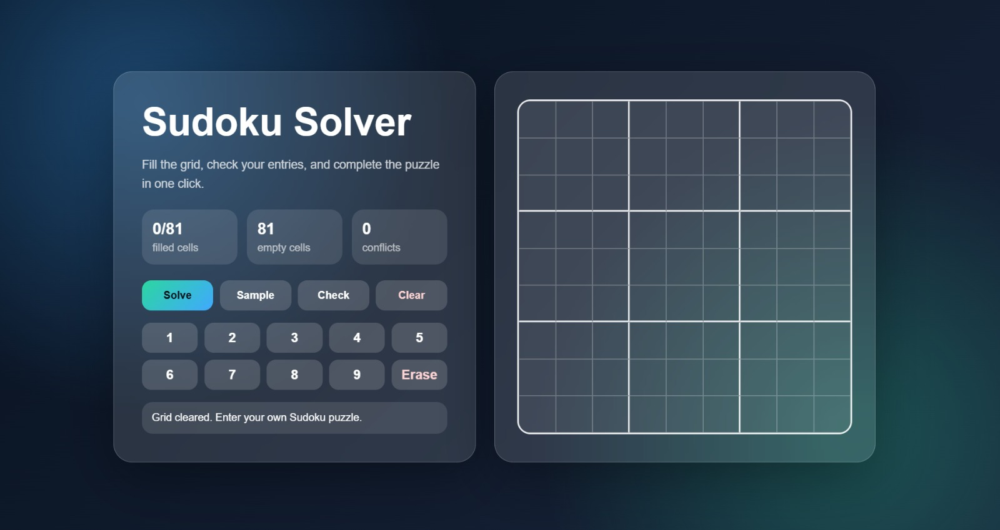
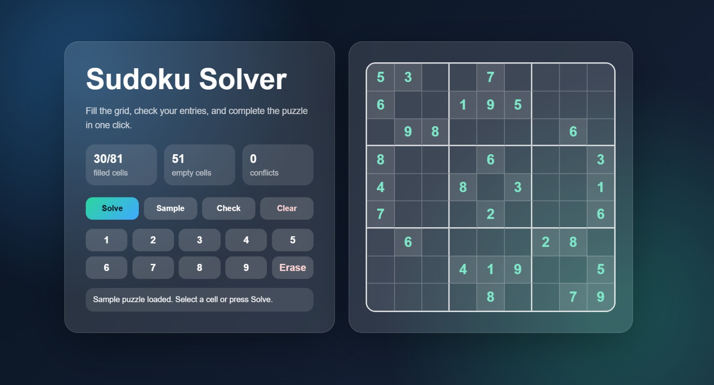
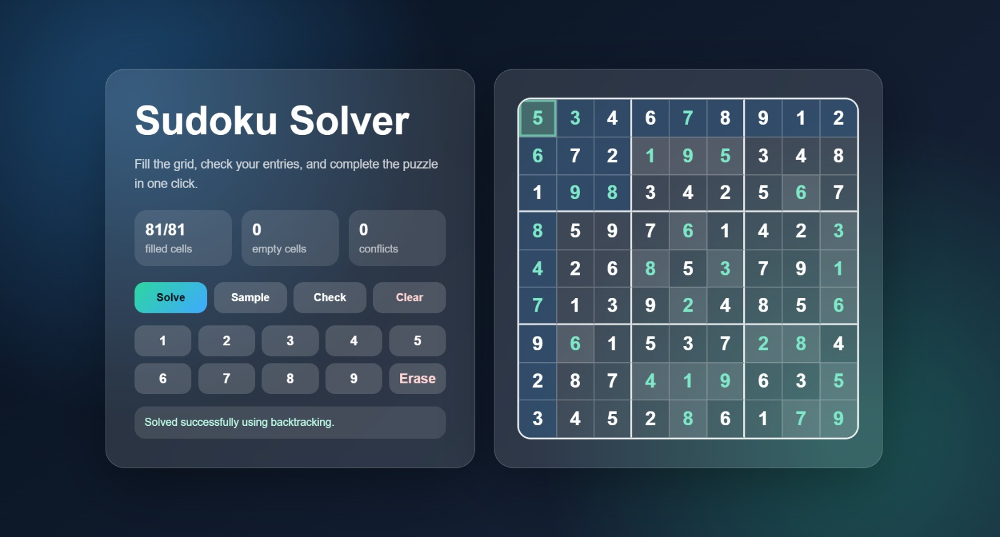

# Task 03 - Sudoku Solver

This project is created as **Task 03** of the **SkillCraft Technology Software Development Internship**.

## Project Overview

Sudoku Solver is a React-based web application where users can enter a Sudoku puzzle, check mistakes, and complete the board in one click.

## Features

- 9x9 Sudoku grid
- Manual number input
- Number pad for easy entry
- Sample puzzle
- Mistake checking
- Clear board option
- Automatic puzzle solving
- Glassmorphism UI

## Tech Stack

- React.js
- JavaScript
- CSS
- Vite

## How To Run

```bash
npm install
npm run dev

```
## Project Structure
```
sudoku-solver/
├── public/
├── src/
│   ├── components/
│   │   ├── Controls.jsx
│   │   ├── NumberPad.jsx
│   │   ├── SudokuCell.jsx
│   │   └── SudokuGrid.jsx
│   ├── data/
│   │   └── samplePuzzle.js
│   ├── styles/
│   │   └── App.css
│   ├── utils/
│   │   └── sudokuSolver.js
│   ├── App.jsx
│   └── main.jsx
├── index.html
├── package.json
└── README.md

```

## Screenshots

## Home page 

---

## Sample Puzzle


---
## Solved Puzzle


---
## Algorithm
The project uses a backtracking approach to solve the Sudoku puzzle. It checks whether a number can be placed in a cell by validating the row, column, and 3x3 box rules. If a number does not lead to a valid solution, the program backtracks and tries another number.


## Usage
Enter numbers in the Sudoku grid or click Sample.
Select a cell and use the number pad.
Click Check to identify mistakes.
Click Solve to complete the puzzle.
Click Clear to reset the board.

## Author
Sakshi Ramakabal Maurya B.Tech in Information Technology at K.j. Somaiya institute of technology
